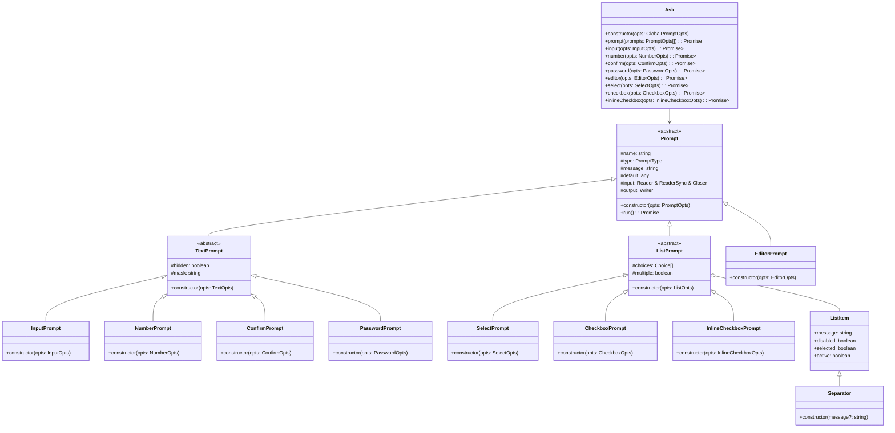

## @jpravetz/ask

This document provides a guide for Gemini to effectively understand and interact with the `@jpravetz/ask` library.

### Project Overview

`@jpravetz/ask` is a Deno library for creating interactive command-line prompts. It is a fork of `@sallai/ask` and provides a simple and intuitive API for creating various types of prompts, such as text input, number input, confirmation, password input, and more. The library is designed to be easy to use and customize, with a focus on type safety.

### Getting Started

The main entry point of the library is the `Ask` class, which is exported from `mod.ts`. To use the library, you need to import the `Ask` class and create a new instance of it. You can then use the methods of the `Ask` class to create different types of prompts.

```typescript
import { Main as Ask } from '@jpravetz/ask';

const ask = new Ask();

const answers = await ask.prompt([
  {
    name: 'name',
    type: 'input',
    message: 'Name:',
  },
  {
    name: 'age',
    type: 'number',
    message: 'Age:',
  },
]);

console.log(answers);
```

### Prompt Types

The library supports the following prompt types:

*   `input`: for simple text input.
*   `number`: for number input, with support for min/max values and integer/float types.
*   `confirm`: for yes/no questions.
*   `password`: for password input, with support for masking.
*   `editor`: for opening a text editor to input a long text.
*   `select`: for selecting a single item from a list.
*   `checkbox`: for selecting multiple items from a list.
*   `inlineCheckbox`: for selecting multiple items from a list, displayed on a single line.

Each prompt type has its own set of options that can be used to customize its behavior.

### Key Modules and Classes

The library is organized into several modules, each with a specific responsibility. The key modules and classes are:

*   **`lib/ask.ts`**: This module contains the `Ask` class, which is the main entry point of the library.
*   **`lib/prompt`**: This directory contains the different prompt classes, such as `InputPrompt`, `NumberPrompt`, `ConfirmPrompt`, etc. Each prompt class is responsible for rendering the prompt and handling user input.
*   **`lib/opts`**: This directory contains the options for each prompt type.
*   **`lib/item`**: This directory contains the `ListItem` and `Separator` classes, which are used to create the items in a list prompt.
*   **`lib/io`**: This directory contains the I/O-related modules, such as `readLine`, `renderList`, and `Writer`. These modules are responsible for reading user input and writing to the console.
*   **`lib/errors.ts`**: This module contains the custom error classes used by the library.
*   **`lib/format.ts`**: This module contains the `Fmt` class, which is used to format the output of the prompts.
*   **`lib/types.ts`**: This module contains the common types used by the library.

The following Mermaid diagram illustrates the relationships between the key classes in the library:



### Development

To contribute to the project, you can use the following commands:

*   `deno task check`: to type-check the code.
*   `deno task lint`: to lint the code.
*   `deno task fmt`: to format the code.