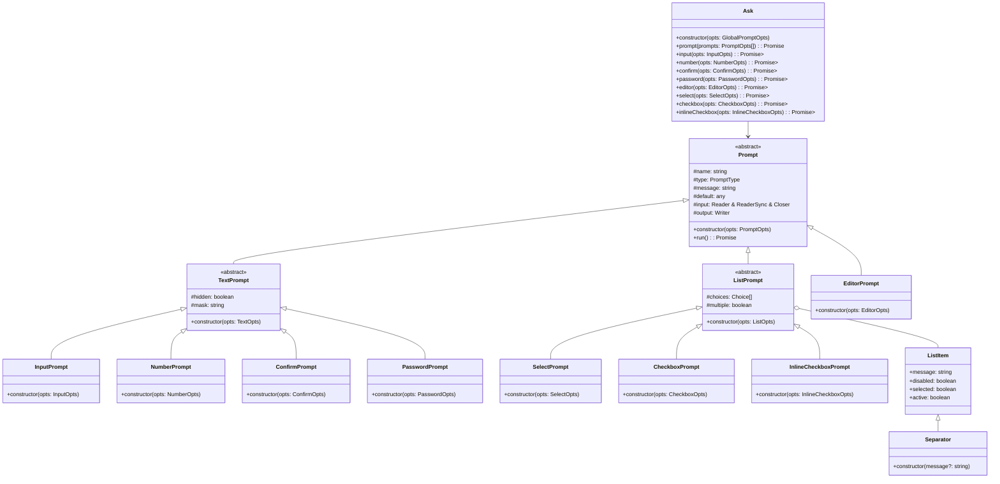

# @jpravetz/ask

Interactive command-line prompts for Deno.

This module is not maintained for others to use. It is a fork of [@sallai/ask](https://github.com/jozsefsallai/ask) and I suggest you use that repo. See [Changelog](./CHANGELOG.md) for differences.


## Description

`ask` is a Deno module that allows you to create interactive command-line applications, similar to what you'd achieve with [inquirer](https://www.npmjs.com/package/inquirer) in Node.js.

## Overview

- **Supported prompts:**
  - `input` (plain text)
  - `number` (integer or float)
  - `password` (hidden/masked input)
  - `confirm` (yes/no)
  - `editor` (open an editor to write longer text)
  - `select` (pick one item from a list)
  - `checkbox` (pick multiple items from a list)
  - `inlineCheckbox` (pick multiple items from a list, contained to one line)
- Elegant output.
- Familiar, inquirer-like syntax.
- Easily configurable.
- Strong type-safety.

## Basic Usage

First, install the package from JSR:

```sh
deno add jsr:@jpravetz/ask
```

Then just create an `Ask` instance and use the `prompt()` method to enumerate
your questions, or ask questions individually.

```ts
import * as Ask from "@jpravetz/ask";

const ask = new Ask.Main({ prefix: '', indent: 8 }); // global options are also supported!

const answers = await ask.prompt(
  [
    {
      name: "name",
      type: "input",
      message: "Name:",
    },
    {
      name: "age",
      type: "number",
      message: "Age:",
    },
  ] as const,
);

console.log(answers); // { name: "Joe", age: 19 }
```

You can also just ask a single question:

```ts
const { name } = await ask.input(
  {
    name: "name",
    message: "Name:",
  } as const,
);

console.log(name); // Joe
```

> **Note:** The `as const` assertion is necessary to ensure that the `name`
> property is not widened to `string`. This is necessary for the type-checking
> to work properly.


This section details the various prompt types available in `@jpravetz/ask`, their specific configuration options, and how they behave during user interaction.

### Common Behaviors

All prompts share some common interactive behaviors:

-   **Arrow Keys (`←`, `→`)**: Move the cursor left and right within text input fields.
-   **Word Navigation (`OPT-←`, `OPT-→` / `CTRL-←`, `CTRL-→`)**: Move the cursor word by word within text input fields.
-   **Line Navigation (`CTRL-A`, `CTRL-E`)**: Move the cursor to the beginning (`CTRL-A`) or end (`CTRL-E`) of the line in text input fields.
-   **Backspace/Delete**: Remove characters from text input fields.
-   **Enter**: Submits the input or confirms a selection.
-   **ESC**: Aborts the current prompt, causing the prompt method to return `undefined`.
-   **CTRL-D**: Triggers the global exit confirmation.
-   **CTRL-R**: Triggers the global `onCtrlR` callback, displaying a spinner during execution.

### `input` Prompt

**Description**: For simple single-line text input.

**Configuration Options**:
-   `name: string` (required): Identifier for the prompt's value.
-   `message: string` (required): The question displayed to the user.
-   `default?: string`: Default value if the user presses Enter without typing.
-   `validate?: (value: string) => boolean | Promise<boolean>`: Function to validate user input.

**Example**:
```ts
const { username } = await ask.input({
  name: "username",
  message: "Enter your username:",
  default: "guest",
});
```

### `number` Prompt

**Description**: For numeric input, supporting integers or floats, with optional range validation.

**Configuration Options**:
-   `name: string` (required): Identifier for the prompt's value.
-   `message: string` (required): The question displayed to the user.
-   `default?: number`: Default numeric value.
-   `numberType?: 'integer' | 'float'`: Specifies the type of number expected (default: `'integer'`).
-   `min?: number`: Minimum allowed value.
-   `max?: number`: Maximum allowed value.
-   `validate?: (value: number) => boolean | Promise<boolean>`: Function to validate user input.

**Behavior**: Automatically validates input to ensure it's a valid number within the specified range and type.

**Example**:
```ts
const { age } = await ask.number({
  name: "age",
  message: "How old are you?",
  min: 0,
  max: 120,
  numberType: "integer",
});
```

### `confirm` Prompt

**Description**: For simple yes/no questions.

**Configuration Options**:
-   `name: string` (required): Identifier for the prompt's value.
-   `message: string` (required): The question displayed to the user.
-   `default?: boolean`: Default answer (`true` for yes, `false` for no).
-   `accept?: string`: Character(s) representing a 'yes' answer (default: `'y'`).
-   `deny?: string`: Character(s) representing a 'no' answer (default: `'n'`).

**Behavior**: User types `y` or `n` (or custom `accept`/`deny` characters) to answer. Pressing Enter without input uses the default.

**Example**:
```ts
const { proceed } = await ask.confirm({
  name: "proceed",
  message: "Do you want to proceed?",
  default: true,
});
```

### `password` Prompt

**Description**: For sensitive input like passwords, where characters should be hidden or masked.

**Configuration Options**:
-   `name: string` (required): Identifier for the prompt's value.
-   `message: string` (required): The question displayed to the user.
-   `mask?: string`: A character to display instead of the actual input (e.g., `'*'`). If not provided, input is completely hidden.

**Behavior**: Input characters are not echoed or are replaced by the `mask` character.

**Example**:
```ts
const { secret } = await ask.password({
  name: "secret",
  message: "Enter your password:",
  mask: "*",
});
```

### `editor` Prompt

**Description**: Opens a temporary file in the user's preferred text editor for multi-line input.

**Configuration Options**:
-   `name: string` (required): Identifier for the prompt's value.
-   `message: string` (required): The initial message displayed.
-   `editorPath?: string`: Path to a specific editor executable (e.g., `'/usr/bin/nano'`). Overrides environment variables.
-   `editorPromptMessage?: string`: Custom message displayed before launching the editor (default: `Press <enter> to launch your preferred editor.`).

**Behavior**: The prompt waits for `Enter` to launch the editor. After the editor is closed, its content is returned.

**Example**:
```ts
const { bio } = await ask.editor({
  name: "bio",
  message: "Write a short biography:",
  editorPath: "code", // Use VS Code if available
});
```

### `select` Prompt

**Description**: Allows the user to select a single item from a list of choices.

**Configuration Options**:
-   `name: string` (required): Identifier for the prompt's value.
-   `message: string` (required): The question displayed to the user.
-   `choices: Choice[]`: An array of `Choice` objects or `Separator` instances.
-   `useNumbers?: boolean`: If `true`, numbers `1-9` are displayed next to the first 9 choices, allowing selection by typing the number. (Default: `false`).
    *   **Note**: While numbers are displayed only for the first 9 choices, the prompt can technically handle selection by number for more items if the user types a multi-digit number.
-   `columns?: number`: Number of columns to display the choices in (default: `1`).
-   `activeFormatter?: (message: string, selected: boolean) => string`: Custom formatter for the active (highlighted) choice.
-   `inactiveFormatter?: (message: string, selected: boolean) => string`: Custom formatter for inactive choices.
-   `disabledFormatter?: (message: string, selected: boolean) => string`: Custom formatter for disabled choices.

**Behavior**:
-   **Arrow Keys (`↑`, `↓`, `←`, `→`)**: Navigate through choices.
-   **Numbers (`1-9`)**: Select a choice by its displayed number (if `useNumbers` is `true`).
-   **Enter**: Confirms the currently active choice.

**Example**:
```ts
import { Separator } from "@jpravetz/ask";

const { color } = await ask.select({
  name: "color",
  message: "Choose a color:",
  choices: [
    { message: "Red", value: "red" },
    { message: "Green", value: "green" },
    new Separator(),
    { message: "Blue", value: "blue" },
  ],
  useNumbers: true,
  columns: 2,
});
```

### `checkbox` Prompt

**Description**: Allows the user to select multiple items from a list of choices.

**Configuration Options**:
-   `name: string` (required): Identifier for the prompt's value.
-   `message: string` (required): The question displayed to the user.
-   `choices: Choice[]`: An array of `Choice` objects or `Separator` instances.
-   `useNumbers?: boolean`: If `true`, numbers `1-9` are displayed next to the first 9 choices. (Default: `false`).
    *   **Note**: Similar to `select`, numbers are displayed only for the first 9 choices, but multi-digit number input can select items beyond the 9th.
-   `columns?: number`: Number of columns to display the choices in (default: `1`).
-   `selectedPrefix?: string`: Prefix for selected items (default: `● `).
-   `unselectedPrefix?: string`: Prefix for unselected items (default: `○ `).
-   `activeFormatter?`, `inactiveFormatter?`, `disabledFormatter?`: Custom formatters for choices.

**Behavior**:
-   **Arrow Keys (`↑`, `↓`, `←`, `→`)**: Navigate through choices.
-   **Spacebar**: Toggles the selection of the currently active choice.
-   **Numbers (`1-9`)**: Select/deselect a choice by its displayed number (if `useNumbers` is `true`).
-   **Enter**: Confirms all selected choices.

**Example**:
```ts
import { Separator } from "@jpravetz/ask";

const { toppings } = await ask.checkbox({
  name: "toppings",
  message: "Select your pizza toppings:",
  choices: [
    { message: "Pepperoni", value: "pepperoni" },
    { message: "Mushrooms", value: "mushrooms" },
    new Separator(),
    { message: "Extra Cheese", value: "cheese" },
  ],
  columns: 2,
});
```

### `inlineCheckbox` Prompt

**Description**: Similar to `checkbox`, but displays choices on a single line, ideal for a small number of options.

**Configuration Options**:
-   `name: string` (required): Identifier for the prompt's value.
-   `message: string` (required): The question displayed to the user.
-   `choices: Choice[]`: An array of `Choice` objects.
-   `selectedPrefix?: string`: Prefix for selected items (default: `● `).
-   `unselectedPrefix?: string`: Prefix for unselected items (default: `○ `).
-   `finalSelectedPrefix?: string`: Prefix for selected items in the final display.
-   `finalUnselectedPrefix?: string`: Prefix for unselected items in the final display.

**Behavior**:
-   **Arrow Keys (`←`, `→`)**: Navigate through choices on the single line.
-   **Spacebar**: Toggles the selection of the currently active choice.
-   **Enter**: Confirms all selected choices.

**Example**:
```ts
const { options } = await ask.inlineCheckbox({
  name: "options",
  message: "Select options:",
  choices: [
    { message: "Option A", value: "A" },
    { message: "Option B", value: "B" },
    { message: "Option C", value: "C" },
  ],
});
```

## Global Preferences and Special Key Behaviors

The `Ask` instance can be configured with global preferences that affect all prompts. These include visual settings like `prefix`, `suffix`, `indent`, and `preNewLine`, as well as handlers for special key presses.

### `onCtrlR` Callback (Global)

The `onCtrlR` callback is a global preference that is triggered when the user presses `CTRL-R` during any prompt. This is useful for implementing a "reload data" functionality in your application.

-   **Behavior**: When `CTRL-R` is pressed, the prompt's prefix (e.g., `?`) is replaced by a spinning indicator (`⠋`, `⠙`, etc.). Your `onCtrlR` callback is then executed.
-   **Return Value Feedback**:
    *   If your `onCtrlR` callback returns `true` (or a `Promise<true>`), the spinner will resolve to a green closed circle (`●`).
    *   If it returns `false` (or a `Promise<false>`), it will resolve to a red closed circle (`●`).
    *   If it returns `void` (or a `Promise<void>`), the spinner will revert to the original prompt prefix.
-   **Developer Action**: Implement the `onCtrlR` function in the `Ask` constructor to perform any necessary data reloading or state updates.

```ts
const ask = new Ask.Main({
  onCtrlR: async () => {
    console.log("\nReloading data...");
    await new Promise((resolve) => setTimeout(resolve, 2000)); // Simulate async work
    console.log("\nData reloaded!");
    return true; // Indicate success
  },
});
```

### `ESC` Key Behavior

The `ESC` key is used to abort the current prompt.

-   **Behavior**: When `ESC` is pressed, the currently active prompt is immediately exited.
-   **Return Value**: The `ask.prompt()` method (or individual prompt methods like `ask.input()`) will return `undefined`.
-   **Developer Action**: Your application code should always check for an `undefined` return value after calling `ask.prompt()` or any individual prompt method. This indicates that the user aborted the prompt, and your application should handle this gracefully (e.g., by exiting, skipping the current step, or displaying a message).

```ts
const result = await ask.input({ name: "name", message: "Your name:" });
if (result === undefined) {
  console.log("Prompt aborted by user.");
  // Handle application exit or skip step
} else {
  console.log(`Hello, ${result.name}`);
}
```

### `CTRL-D` Key Behavior

The `CTRL-D` key is used to signal an end-of-file or to request an exit from a series of prompts.

-   **Behavior**: When `CTRL-D` is pressed, the application will display a confirmation prompt: "You pressed Ctrl-D. Do you want to exit? [Y/n]".
-   **Return Value**:
    *   If the user confirms to exit, the `ask.prompt()` method (or individual prompt methods) will throw a `UserAbortedError`.
    *   If the user chooses not to exit, the current prompt will be re-displayed, allowing them to continue.
-   **Developer Action**: Your application code should wrap calls to `ask.prompt()` (or individual prompt methods) in a `try...catch` block to handle `UserAbortedError`. This error indicates that the user explicitly chose to exit the application.

```ts
try {
  const answers = await ask.prompt([
    // ... your prompts
  ]);
  if (answers) {
    console.log("Answers:", answers);
  } else {
    // This path is taken if a prompt is aborted with ESC
    console.log("Prompt series aborted with ESC.");
  }
} catch (error) {
  if (error instanceof UserAbortedError) {
    console.log("Application exited by user (Ctrl-D).");
    Deno.exit(0); // Gracefully exit the application
  } else {
    throw error; // Re-throw other unexpected errors
  }
}
```

## Documentation and API

Please visit the [JSR documentation page][docs] for more information on how to
use the library.

## Object Relationships



## License

MIT.

[docs]: https://jsr.io/@sallai/ask/doc