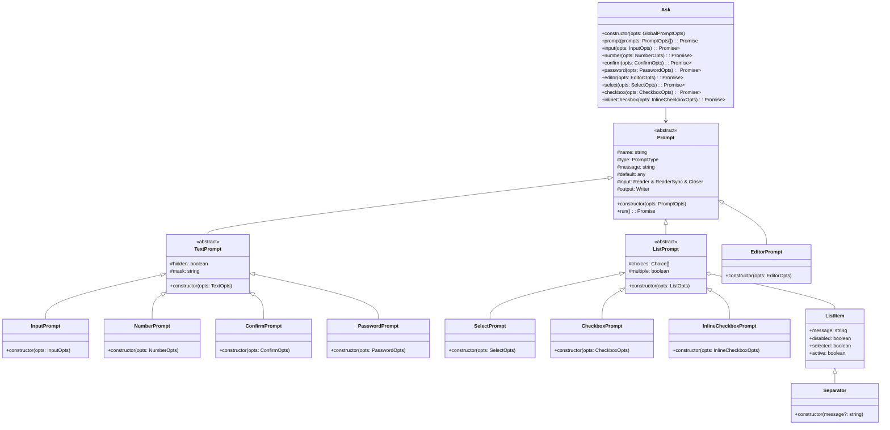

# @jpravetz/ask

Interactive command-line prompts for Deno.

This module is not maintained for others to use. It is a fork of [@sallai/ask](https://github.com/jozsefsallai/ask). I do think this module has signficant advantages, so feel free to use it, but I am not committing to long term maintenance.


## Description

`ask` is a Deno module that allows you to create interactive command-line applications, similar to what you'd achieve with [inquirer](https://www.npmjs.com/package/inquirer) in Node.js.

## Overview

- **Supported prompts:**
  - `input` (plain text)
  - `number` (integer or float)
  - `password` (hidden/masked input)
  - `confirm` (yes/no)
  - `editor` (open an editor to write longer text)
  - `select` (pick one item from a list)
  - `checkbox` (pick multiple items from a list)
  - `inlineCheckbox` (pick multiple items from a list, contained to one line)
- Elegant output.
- Familiar, inquirer-like syntax.
- Easily configurable.
- Strong type-safety.

## Basic Usage

First, install the package from JSR:

```sh
deno add jsr:@jpravetz/ask
```

Then just create an `Ask` instance and use the `prompt()` method to enumerate
your questions, or ask questions individually.

```ts
import * as Ask from "@jpravetz/ask";

const ask = new Ask.Main({ prefix: '', indent: 8 }); // global options are also supported!

const answers = await ask.prompt(
  [
    {
      name: "name",
      type: "input",
      message: "Name:",
    },
    {
      name: "age",
      type: "number",
      message: "Age:",
    },
  ] as const,
);

console.log(answers); // { name: "Joe", age: 19 }
```

You can also just ask a single question:

```ts
const { name } = await ask.input(
  {
    name: "name",
    message: "Name:",
  } as const,
);

console.log(name); // Joe
```

> **Note:** The `as const` assertion is necessary to ensure that the `name`
> property is not widened to `string`. This is necessary for the type-checking
> to work properly.


This section details the various prompt types available in `@jpravetz/ask`, their specific configuration options, and how they behave during user interaction.

### Common Behaviors

All prompts share some common interactive behaviors:

-   **Arrow Keys (`←`, `→`)**: Move the cursor left and right within text input fields.
-   **Word Navigation (`OPT-←`, `OPT-→` / `CTRL-←`, `CTRL-→`)**: Move the cursor word by word within text input fields.
-   **Line Navigation (`CTRL-A`, `CTRL-E`)**: Move the cursor to the beginning (`CTRL-A`) or end (`CTRL-E`) of the line in text input fields.
-   **Backspace/Delete**: Remove characters from text input fields.
-   **Enter**: Submits the input or confirms a selection.
-   **ESC**: Aborts the current prompt, causing the prompt method to return `undefined`.
-   **CTRL-D**: Triggers the global exit confirmation.
-   **0**: In `select` and `checkbox` prompts, when the `returnToMainMenu` option is enabled, pressing `0` throws a `ReturnToMainMenuError`. See [Return to Main Menu](#return-to-main-menu).
-   **Key bindings**: Configured `ctrl`/`alt` key combinations resolve `select` and `checkbox` prompts with the binding's value, exactly as if the matching choice had been selected. See [Key Bindings (Global)](#key-bindings-global).

### `input` Prompt

**Description**: For simple single-line text input.

**Configuration Options**:
-   `name: string` (required): Identifier for the prompt's value.
-   `message: string` (required): The question displayed to the user.
-   `default?: string`: Default value if the user presses Enter without typing.
-   `validate?: (value: string) => boolean | Promise<boolean>`: Function to validate user input.

**Example**:
```ts
const { username } = await ask.input({
  name: "username",
  message: "Enter your username:",
  default: "guest",
});
```

### `number` Prompt

**Description**: For numeric input, supporting integers or floats, with optional range validation.

**Configuration Options**:
-   `name: string` (required): Identifier for the prompt's value.
-   `message: string` (required): The question displayed to the user.
-   `default?: number`: Default numeric value.
-   `numberType?: 'integer' | 'float'`: Specifies the type of number expected (default: `'integer'`).
-   `min?: number`: Minimum allowed value.
-   `max?: number`: Maximum allowed value.
-   `validate?: (value: number) => boolean | Promise<boolean>`: Function to validate user input.

**Behavior**: Automatically validates input to ensure it's a valid number within the specified range and type.

**Example**:
```ts
const { age } = await ask.number({
  name: "age",
  message: "How old are you?",
  min: 0,
  max: 120,
  numberType: "integer",
});
```

### `confirm` Prompt

**Description**: For simple yes/no questions.

**Configuration Options**:
-   `name: string` (required): Identifier for the prompt's value.
-   `message: string` (required): The question displayed to the user.
-   `default?: boolean`: Default answer (`true` for yes, `false` for no). If provided, "Yes" or "No" will be displayed in color initially.
-   `accept?: string`: Overrides the default 'yes' character (default: `'y'`). Note: `y`, `1`, and `t` (case-insensitive) are always accepted.
-   `deny?: string`: Overrides the default 'no' character (default: `'n'`). Note: `n`, `0`, and `f` (case-insensitive) are always accepted.

**Behavior**: This prompt is highly interactive.
-   If a `default` value is provided, it will be displayed initially (e.g., "Yes" in green).
-   Typing `y`, `Y`, `1`, `t`, or `T` will instantly update the display to show "Yes".
-   Typing `n`, `N`, `0`, `f`, or `F` will instantly update the display to show "No".
-   Pressing `Backspace` or `Delete` will clear the current selection.
-   Pressing `Enter` confirms the currently displayed choice. If no choice is displayed, `Enter` is ignored.

**Example**:
```ts
const { proceed } = await ask.confirm({
  name: "proceed",
  message: "Do you want to proceed?",
  default: true,
});
```

### `password` Prompt

**Description**: For sensitive input like passwords, where characters should be hidden or masked.

**Configuration Options**:
-   `name: string` (required): Identifier for the prompt's value.
-   `message: string` (required): The question displayed to the user.
-   `mask?: string | boolean`: A character to display instead of the actual input. If set to `true`, `•` is used. If a `string` is provided (e.g., `'*'`), its first character is used. If omitted or `false`, input is completely hidden.

**Behavior**: Input characters are not echoed or are replaced by the `mask` character.

**Example**:
```ts
const { secret } = await ask.password({
  name: "secret",
  message: "Enter your password:",
  mask: true, // Will display '•' for each character
});
```

### `select` Prompt

**Description**: Allows the user to select a single item from a list of choices.

**Configuration Options**:
-   `name: string` (required): Identifier for the prompt's value.
-   `message: string` (required): The question displayed to the user.
-   `choices: Choice[]`: An array of `Choice` objects or `Separator` instances.
-   `useNumbers?: boolean`: If `true`, numbers `1-9` are displayed next to the first 9 choices, allowing selection by typing the number. (Default: `false`).
    *   **Note**: While numbers are displayed only for the first 9 choices, the prompt can technically handle selection by number for more items if the user types a multi-digit number.
-   `columns?: number`: Number of columns to display the choices in (default: `1`).
-   `keyBindings?: KeyBinding[]`: Key combinations (e.g. `CTRL-R`) that resolve the prompt with the binding's `value`, exactly as if the matching choice had been selected. Replaces the global `keyBindings` for this prompt. See [Key Bindings (Global)](#key-bindings-global).
-   `activeFormatter?: (message: string, selected: boolean) => string`: Custom formatter for the active (highlighted) choice.
-   `inactiveFormatter?: (message: string, selected: boolean) => string`: Custom formatter for inactive choices.
-   `disabledFormatter?: (message: string, selected: boolean) => string`: Custom formatter for disabled choices.

**Behavior**:
-   **Arrow Keys (`↑`, `↓`, `←`, `→`)**: Navigate through choices.
-   **Numbers (`1-9`)**: Select a choice by its displayed number (if `useNumbers` is `true`).
-   **Key Bindings**: Pressing a configured key binding resolves the prompt with the binding's value. See [Key Bindings (Global)](#key-bindings-global).
-   **Enter**: Confirms the currently active choice.

**Example**:
```ts
import { Separator } from "@jpravetz/ask";

const { color } = await ask.select({
  name: "color",
  message: "Choose a color:",
  choices: [
    { message: "Red", value: "red" },
    { message: "Green", value: "green" },
    new Separator(),
    { message: "Blue", value: "blue" },
  ],
  useNumbers: true,
  columns: 2,
});
```

### `checkbox` Prompt

**Description**: Allows the user to select multiple items from a list of choices.

**Configuration Options**:
-   `name: string` (required): Identifier for the prompt's value.
-   `message: string` (required): The question displayed to the user.
-   `choices: Choice[]`: An array of `Choice` objects or `Separator` instances.
-   `useNumbers?: boolean`: If `true`, numbers `1-9` are displayed next to the first 9 choices. (Default: `false`).
    *   **Note**: Similar to `select`, numbers are displayed only for the first 9 choices, but multi-digit number input can select items beyond the 9th.
-   `columns?: number`: Number of columns to display the choices in (default: `1`).
-   `selectedPrefix?: string`: Prefix for selected items (default: `● `).
-   `unselectedPrefix?: string`: Prefix for unselected items (default: `○ `).
-   `keyBindings?: KeyBinding[]`: Key combinations (e.g. `CTRL-R`) that resolve the prompt with the binding's `value`, exactly as if the matching choice had been selected. Replaces the global `keyBindings` for this prompt. See [Key Bindings (Global)](#key-bindings-global).
-   `activeFormatter?`, `inactiveFormatter?`, `disabledFormatter?`: Custom formatters for choices.

**Behavior**:
-   **Arrow Keys (`↑`, `↓`, `←`, `→`)**: Navigate through choices.
-   **Spacebar**: Toggles the selection of the currently active choice.
-   **CTRL-A**: Toggles between "select all" and "deselect all" states. If any items are unselected, selects all selectable items. If all items are selected, deselects all items.
-   **SHIFT-UP/SHIFT-DOWN**: Navigate while propagating the current item's selection state to the destination item.
-   **SHIFT-LEFT/SHIFT-RIGHT**: Navigate while propagating the current item's selection state to the destination item (for multi-column layouts).
-   **Numbers (`1-9`)**: Select/deselect a choice by its displayed number (if `useNumbers` is `true`).
-   **Key Bindings**: Pressing a configured key binding resolves the prompt with the binding's value. See [Key Bindings (Global)](#key-bindings-global).
-   **Enter**: Confirms all selected choices.

**Example**:
```ts
import { Separator } from "@jpravetz/ask";

const { toppings } = await ask.checkbox({
  name: "toppings",
  message: "Select your pizza toppings:",
  choices: [
    { message: "Pepperoni", value: "pepperoni" },
    { message: "Mushrooms", value: "mushrooms" },
    new Separator(),
    { message: "Extra Cheese", value: "cheese" },
  ],
  columns: 2,
});
```

### `inlineCheckbox` Prompt

**Description**: Similar to `checkbox`, but displays choices on a single line, ideal for a small number of options.

**Configuration Options**:
-   `name: string` (required): Identifier for the prompt's value.
-   `message: string` (required): The question displayed to the user.
-   `choices: Choice[]`: An array of `Choice` objects.
-   `selectedPrefix?: string`: Prefix for selected items (default: `● `).
-   `unselectedPrefix?: string`: Prefix for unselected items (default: `○ `).
-   `finalSelectedPrefix?: string`: Prefix for selected items in the final display.
-   `finalUnselectedPrefix?: string`: Prefix for unselected items in the final display.

**Behavior**:
-   **Arrow Keys (`←`, `→`)**: Navigate through choices on the single line.
-   **Spacebar**: Toggles the selection of the currently active choice.
-   **Enter**: Confirms all selected choices.

**Example**:
```ts
const { options } = await ask.inlineCheckbox({
  name: "options",
  message: "Select options:",
  choices: [
    { message: "Option A", value: "A" },
    { message: "Option B", value: "B" },
    { message: "Option C", value: "C" },
  ],
});
```

### `editor` Prompt

> **Note:** This prompt is not currently supported and may not function as expected.

**Description**: Opens a temporary file in the user's preferred text editor for multi-line input.

**Configuration Options**:
-   `name: string` (required): Identifier for the prompt's value.
-   `message: string` (required): The initial message displayed.
-   `editorPath?: string`: Path to a specific editor executable (e.g., `'/usr/bin/nano'`). Overrides environment variables.
-   `editorPromptMessage?: string`: Custom message displayed before launching the editor (default: `Press <enter> to launch your preferred editor.`).

**Behavior**: The prompt waits for `Enter` to launch the editor. After the editor is closed, its content is returned.

**Example**:
```ts
const { bio } = await ask.editor({
  name: "bio",
  message: "Write a short biography:",
  editorPath: "code", // Use VS Code if available
});
```

## Global Preferences and Special Key Behaviors

The `Ask` instance can be configured with global preferences that affect all prompts. These include visual settings like `prefix`, `suffix`, `indent`, and `preNewLine`, as well as key bindings and the `returnToMainMenu` feature.

### `Key Bindings` (Global)

Key bindings let you map key combinations (e.g. `CTRL-R`) to a value. When the
key is pressed in a `select` or `checkbox` prompt, the prompt resolves with that
value exactly as if the user had selected a matching choice. This makes bound
actions flow through the normal prompt result handling of your application,
with no custom key-press handling required.

-   **Behavior**: The binding's `value` is returned as the prompt's answer when
    the key is pressed. Key bindings are matched before built-in keys, so a
    binding can override default behavior.
-   **Modifiers**: `ctrl` (default) and `alt`. For `ctrl`, the key is a letter
    (e.g. `'r'` for Ctrl-R). For `alt`, the key is a single character.
-   **Arrow keys**: `key` may also be `'up'`, `'down'`, `'left'`, or `'right'`
    to bind an arrow key. No modifier is used for these.
-   **Scope**: Applies to `select` and `checkbox` prompts. Other prompt types
    are unaffected.
-   **Override**: Per-prompt `keyBindings` replace the global bindings for that
    prompt.

```ts
const ask = new Ask.Main({
  keyBindings: [{ key: 'r', modifier: 'ctrl', value: 'reload' }],
});

// Pressing Ctrl-R resolves `action` with the value "reload".
const { action } = await ask.select({
  name: 'action',
  message: 'Choose an operation',
  choices: [
    { message: 'View', value: 'view' },
    { message: 'Reload', value: 'reload' },
  ],
});
```

Arrow keys are bound the same way, without a modifier. The binding overrides
the default arrow-key navigation:

```ts
const ask = new Ask.Main({
  keyBindings: [{ key: 'left', value: 'back' }],
});

// Pressing the left arrow key resolves `action` with the value "back".
const { action } = await ask.select({
  name: 'action',
  message: 'Choose an operation',
  choices: [
    { message: 'View', value: 'view' },
    { message: 'Back', value: 'back' },
  ],
});
```

### `Return to Main Menu` (Global)

The `returnToMainMenu` option provides a consistent way for users to navigate back to the application's main menu from any `select` or `checkbox` page. When enabled, pressing the `0` key in a list prompt causes the prompt to throw a `ReturnToMainMenuError`, which the application catches to display its main menu.

-   **Behavior**:
    *   Pressing `0` in a `select` or `checkbox` prompt throws a `ReturnToMainMenuError`.
    *   The rendered list and prompt line are cleaned up from the screen before the error is thrown.
-   **Configuration**: The `returnToMainMenu` global option accepts one of three values:
    *   `'visible'`: Enabled. A `0. Return to Main Menu` item is displayed below the choices. It is not part of arrow-key navigation; it is triggered only by pressing `0`.
    *   `'hidden'`: Enabled, but the item is not displayed. Pressing `0` still works silently.
    *   `'off'` (default): Disabled. Pressing `0` has no effect.
-   **Label**: The displayed label defaults to `'Return to Main Menu'` and can be customized with the `returnToMainMenuLabel` global option.
-   **Prompt Types**: Applies to `select` and `checkbox` prompts. Other prompt types are unaffected.
-   **Developer Action**: Wrap calls to list prompts in a `try...catch` block and handle `ReturnToMainMenuError` by navigating back to the main menu.

```ts
import { Ask, ReturnToMainMenuError } from "@jpravetz/ask";

const ask = new Ask.Main({
  returnToMainMenu: "visible",
  returnToMainMenuLabel: "Return to Main Menu",
});

async function showMainMenu() {
  // ... render the main menu ...
}

while (true) {
  try {
    const { page } = await ask.select({
      name: "page",
      message: "Choose an option:",
      choices: [
        { message: "Settings", value: "settings" },
        { message: "Help", value: "help" },
      ],
    });
    // ... handle the selected page ...
  } catch (error) {
    if (error instanceof ReturnToMainMenuError) {
      await showMainMenu();
    } else {
      throw error;
    }
  }
}
```

### `ESC` Key Behavior

The `ESC` key is used to abort the current prompt.

-   **Behavior**: When `ESC` is pressed, the currently active prompt is immediately exited.
-   **Return Value**: The `ask.prompt()` method (or individual prompt methods like `ask.input()`) will return `undefined`.
-   **Developer Action**: Your application code should always check for an `undefined` return value after calling `ask.prompt()` or any individual prompt method. This indicates that the user aborted the prompt, and your application should handle this gracefully (e.g., by exiting, skipping the current step, or displaying a message).

```ts
const result = await ask.input({ name: "name", message: "Your name:" });
if (result === undefined) {
  console.log("Prompt aborted by user.");
  // Handle application exit or skip step
} else {
  console.log(`Hello, ${result.name}`);
}
```

### `CTRL-D` Key Behavior

The `CTRL-D` key is used to signal an end-of-file or to request an exit from a series of prompts.

-   **Behavior**: When `CTRL-D` is pressed, the application will display a confirmation prompt: "You pressed Ctrl-D. Do you want to exit? [Y/n]".
-   **Return Value**:
    *   If the user confirms to exit, the `ask.prompt()` method (or individual prompt methods) will throw a `UserAbortedError`.
    *   If the user chooses not to exit, the current prompt will be re-displayed, allowing them to continue.
-   **Developer Action**: Your application code should wrap calls to `ask.prompt()` (or individual prompt methods) in a `try...catch` block to handle `UserAbortedError`. This error indicates that the user explicitly chose to exit the application.

```ts
try {
  const answers = await ask.prompt([
    // ... your prompts
  ]);
  if (answers) {
    console.log("Answers:", answers);
  } else {
    // This path is taken if a prompt is aborted with ESC
    console.log("Prompt series aborted with ESC.");
  }
} catch (error) {
  if (error instanceof UserAbortedError) {
    console.log("Application exited by user (Ctrl-D).");
    Deno.exit(0); // Gracefully exit the application
  } else {
    throw error; // Re-throw other unexpected errors
  }
}
```

### Limitations

-   **Multi-line Input Display**: The `input` prompt is designed for single-line text input. If the prompt message combined with the user's input exceeds the terminal width, the display may become garbled or show repeating prompt messages due to the terminal's line-wrapping behavior and the current rendering mechanism. For multi-line text input, please use the `editor` prompt.

## Menu Framework

In addition to individual prompts, `ask` ships with a small declarative framework
for building menu-driven interactive applications. You describe your menus as a
**tree** of nodes, and a single driver (`Menu.runMenu`) handles rendering,
navigation, and the back/forward history. This removes the need to hand-wire
"what should happen next" after every selection.

-   A **node** is a menu: a prompt message plus a list of choices.
-   A **choice** either opens a submenu (`node: 'id'`) or runs an **action**
    (`action: 'name'` or an inline function).
-   Navigation is structural: picking a submenu pushes the current menu onto a
    history stack; `ESC` / `←` pops back (a no-op at the root); `→` moves
    forward again. Running an action re-renders the current menu unless the
    action returns a signal (`BACK`, `FORWARD`, `EXIT`) or a `NodeRef`
    (`{ node: 'id' }`) to jump to another branch (e.g. after a search shows a
    result table and should land on a "messages" menu).
-   Choices and messages can be **functions of a context** object, so menus can
    be assembled dynamically (conditional choices, computed labels, etc.).
-   **Universal key bindings** act like hidden menu items available from every
    menu. Values may be a signal, a `NodeRef`, or a registered action name.
    Optional `hint` strings render them in a footer below the choices (separated
    by a blank line). The footer can be turned off with `showKeyBindings: false`
    or toggled dynamically by passing a function of the context.

```ts
import { Ask, Menu } from '@jpravetz/ask';

const ask = new Ask.Main({ returnToMainMenu: 'hidden' });

const actions = Menu.createActions({
  fetch: async (shell) => { console.log('Fetching…'); },
  exit: () => Menu.EXIT,
});

const tree: Menu.MenuTree<{}> = {
  root: {
    message: 'Main Menu',
    choices: [
      { message: 'Fetch New Messages', action: actions.Action.fetch },
      { message: 'Search ▶', node: 'search' },
      { message: 'Exit', action: actions.Action.exit },
    ],
  },
  search: {
    message: 'Search Local Database',
    choices: [
      { message: 'By Date', action: () => console.log('date search') },
      { message: '◀ Back', node: 'root' },
    ],
  },
};

await Menu.runMenu(tree, {
  ctx: {},
  ask,
  actions,
  keyBindings: [
    { key: 's', modifier: 'ctrl', value: { node: 'search' }, hint: 'Search' },
  ],
});
```

### Menu Reference

-   `Menu.MenuTree<C>` / `Menu.MenuNode<C>` / `Menu.MenuChoice<C>` — the tree
    shape. `message`, `choices`, and `disabled` may be functions of the context
    `C`.
-   `Menu.MenuAction<C>` — `(ctx) => MenuResult<C> | Promise<MenuResult<C>>`,
    where `MenuResult<C>` is a signal, a `NodeRef`, or `void` (re-render).
-   `Menu.createActions<C>(defs)` — builds a type-safe action registry. The
    returned `Action` constant mirrors the handler names.
-   `Menu.runMenu(tree, opts)` — runs the session. `opts` take the context
    `ctx`, the `ask` instance, `actions`, the root node id, universal
    `keyBindings`, and `showKeyBindings` (a boolean or a function of the
    context; the hint footer defaults to on when hints exist). `BACK` at the
    root is a no-op (exit via an explicit `EXIT` action).
-   `Menu.NAV_KEYS` — the default `←`/`→` → `BACK`/`FORWARD` bindings.
-   `Menu.BACK` / `Menu.FORWARD` / `Menu.EXIT` / `Menu.REDISPLAY` — navigation
    signals (`REDISPLAY` is a no-op; the default after an action is to stay).

## Documentation and API

Please visit the [JSR documentation page][docs] for more information on how to
use the library.

## Object Relationships


```mermaid
classDiagram
  class Ask {
    +constructor(opts: GlobalPromptOpts)
    +prompt(prompts: PromptOpts[]): Promise<any>
    +input(opts: InputOpts): Promise<Result<string | undefined>>
    +number(opts: NumberOpts): Promise<Result<number | undefined>>
    +confirm(opts: ConfirmOpts): Promise<Result<boolean | undefined>>
    +password(opts: PasswordOpts): Promise<Result<string | undefined>>
    +editor(opts: EditorOpts): Promise<Result<string | undefined>>
    +select(opts: SelectOpts): Promise<Result<unknown>>
    +checkbox(opts: CheckboxOpts): Promise<Result<unknown[]>>
    +inlineCheckbox(opts: InlineCheckboxOpts): Promise<Result<unknown[]>>
  }

  class Prompt {
    <<abstract>>
    #name: string
    #type: PromptType
    #message: string
    #default: any
    #input: Reader & ReaderSync & Closer
    #output: Writer
    +constructor(opts: PromptOpts)
    +run(): Promise<any>
  }

  class TextPrompt {
    <<abstract>>
    #hidden: boolean
    #mask: string
    +constructor(opts: TextOpts)
  }

  class ListPrompt {
    <<abstract>>
    #choices: Choice[]
    #multiple: boolean
    +constructor(opts: ListOpts)
  }

  class InputPrompt {
    +constructor(opts: InputOpts)
  }

  class NumberPrompt {
    +constructor(opts: NumberOpts)
  }

  class ConfirmPrompt {
    +constructor(opts: ConfirmOpts)
  }

  class PasswordPrompt {
    +constructor(opts: PasswordOpts)
  }

  class EditorPrompt {
    +constructor(opts: EditorOpts)
  }

  class SelectPrompt {
    +constructor(opts: SelectOpts)
  }

  class CheckboxPrompt {
    +constructor(opts: CheckboxOpts)
  }

  class InlineCheckboxPrompt {
    +constructor(opts: InlineCheckboxOpts)
  }

  class ListItem {
    +message: string
    +disabled: boolean
    +selected: boolean
    +active: boolean
  }

  class Separator {
    +constructor(message?: string)
  }

  Ask --> Prompt
  Prompt <|-- TextPrompt
  Prompt <|-- ListPrompt
  Prompt <|-- EditorPrompt
  TextPrompt <|-- InputPrompt
  TextPrompt <|-- NumberPrompt
  TextPrompt <|-- ConfirmPrompt
  TextPrompt <|-- PasswordPrompt
  ListPrompt <|-- SelectPrompt
  ListPrompt <|-- CheckboxPrompt
  ListPrompt <|-- InlineCheckboxPrompt
  ListPrompt o-- ListItem
  ListItem <|-- Separator
```

## License

MIT.

[docs]: https://jsr.io/@sallai/ask/doc